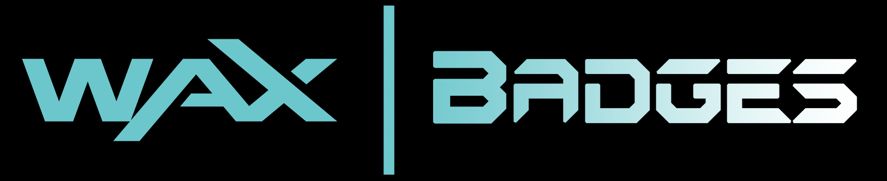

### Achievements logged on the blockchain for eternity! Keep what you earn!


# WAXBadges
_An open Achievements platform for the WAX blockchain_

twitter: [@WAXBadges](https://twitter.com/WAXBadges)


Basic WAXBadges Achievement Explorer is live: [explorer.waxbadges.com](https://explorer.waxbadges.com)

## Motivation
Current achievement systems are completely trapped within their own ecosystems--XBox gamertags, each individual mobile app, Steam trophies, even certifications for tech or skills training (e.g. Khan Academy badges).

I shouldn't have to go to each individual ecosystem or sign into each individual app to see and share my achievements. But there's currently no way to view my accomplishments from, say, Steam alongside all my mobile game achievements and every other game all in one place.

This siloing has another bad consequence: my achievements suffer from varying levels of impermanence and fragility. I can work my tail off to unlock a new badge in my running app ("50-Mile Club!") but if that service shuts down, poof! My badge goes with it.


### Enter the blockchain
The blockchain offers permanent, public online data storage. Writing achievements to the blockchain will preserve them regardless of what happens to the company that originally granted them. And once your achievements are written to the blockchain it'll be simple to view them all--across all your games--in one grand trophy room and share them out to social media.


## WAXBadges overview
WAXBadges is a WAX smart contract and related services that provide a simple, open platform for any permanent achievement system to be built upon. Think of WAXBadges as a kind of backend service (AaaS -- Achievements as a Service?) that handles storage, permissions logic, management, and more. This allows game developers to easily write their users' achievements as WAXBadges to the WAX blockchain. Their players will be extra-excited to stay engaged with their games as they see their in-game achievements now accessible in one central location.

The smart contract details will be totally hidden away from the players; they won't need to know anything about blockchains to be able to unlock and view achievements. 

WAXBadges also supports achievements that can be limited in quantity to provide enhanced exclusivity and greater player engagement as they race to be the early few who are able to claim a rare, limited achievement. _Coming soon_


### Easy onboarding; "custodial" achievements
A big hurdle with blockchain-based user data systems is the overly complex onboarding process: would-be users have to convert fiat to crypto; set up access to those funds via tools like Metamask, Scatter, etc; and be comfortable signing transactions and managing their private/public keys. This is just not a reasonable expectation for 99% of gamers.

So instead WAXBadges allows each project to add their users without worrying about whether or not the user has an on-chain account. Gamers' account records exist as simple `string` blockchain data based solely on the game's internal records (`name=Keith01`, `userid=your_internal_id_1234`). The studio can then immediately start granting achievements to their users. At this stage these blockchain user achievements can be thought of as being held _in custody_ on their users' behalf.

But for more advanced users...

### Claim ownership; unify achievements
If a user has the interest and the savvy to create their own blockchain account, WAXBadges provides a mechanism for them to claim their user identity in each studio's achievement ecosystem. This then allows them to view all of their achievements--across all participating games, studios, and platforms--in one place.

In brief:
* Each studio would provide an option for a user to specify their blockchain account in their in-game profile.
* The studio would write this additional info to the gamer's `User` record on chain.
* The gamer can then submit a transaction to the WAXBadges smart contract to "claim" each `User` entry and permanently tie them to their blockchain account.

After the claims are made it is then simple for a gamer to view all of their WAXBadges achievements in one place via an WAXBadges-aware block explorer.


### Expand achievements beyond gaming
WAXBadges is launching with a proof-of-concept achievement campaign based solely on twitter activity. WAXBadges is a totally open platform so _any_ entity can create an achievements ecosystem for _any_ kind of activity. It doesn't matter if that activity happens in a video game, in a twitter thread, or offline in the real world.

This opens up new outreach possibilities that can also benefit from the permanence of the blockchain. Imagine a limited quantity achievement set up by a musician or DJ with a rabid fanbase. "The first 30k fans to do X will gain 'True Swifty' status... for life!"


### Structure
The basic organizational structure of WAXBadges achievements is pretty simple:
```
    Ecosystem: "Banzai's Great Adventure"
    |
    +----Category: "Solo"
    |    |
    |    +----Achievement: "Coin Master"
    |    +----Achievement: "Treasure Finder"
    |    +----Achievement: "Grinder Extraordinaire"
    |
    |
    +----Category: "Team"
         |
         +----Achievement: "Purple Heart"
         +----Achievement: "My Savior"
         +----Achievement: "MVP"
         +----Achievement: "Da GOAT"
```

Each individual game would create its own **Ecosystem** entry. _Note that WAXBadges doesn't have to be limited to just gaming use cases. An `Ecosystem` could be created for academic awards (e.g. a high school's NHS inductees), records for a sports team, certifications for a training system, etc._

A game studio creates a new `Ecosystem` in two simple steps:
* Create a blockchain account for their studio (or a separate account for each game they produce).
* Submit a simple transaction from that account to the WAXBadges smart contract to create a new `Ecosystem` entry.

The WAXBadges smart contract ensures that the studio's blockchain account is the only one that can then alter any of the data within that new `Ecosystem`.

They are then free to define whatever achievement **Categories** make sense for their game. _Note: at least one `Category` is required, but it can be a generic catch-all if the studio doesn't need different categories._

Finally they add various **Achievements** within a `Category`.

The actual `Achievement` entry consists of a title, description, and the name of an image asset (more on assets below):
```
{
    name: "Spicy Stunt Roll",
    description: "Rolled through fire while shielded",
    assetname: "spicy_roll.png"
}
```


### Assets
Images for each achievement are probably too much data to store on the blockchain. So instead each `Ecosystem` specifies an `assetbaseurl` (e.g. "mydomainname.com/images/trophies"). This is then combined with the `Achievement.assetname` to yield a complete url: https://mydomainname.com/images/trophies/spicy_roll.png.

The studio can always change the `Ecosystem.assetbaseurl` if they need to change domains, hosts, etc.

In this way we strike a compromise between providing nicely rendered achievement browsing without burdening game studios with excessive blockchain storage costs.


# Technical Notes

## Achievements are not NFTs
The WAX blockchain is focused on its NFT (Non-Fungible Token) marketplace for digital collectibles like OpsSkins. Once an NFT is purchased on the marketplace the owner has the option to resell it as s/he sees fit.

But achievements have different properties, the primary one being that they must be non-transferrable. Either you earned the achievement or you didn't; there's no buying your way into achievement bragging rights.


## Blockchain storage costs
The structure above was carefully designed to minimize blockchain storage costs. There are _**numerous**_ pitfalls when storing data to the blockchain that could prove _**very**_ costly if done poorly.

I learned this the hard way while developing the first version of this project for the EOS blockchain. I have a full writeup here: [RAM Rekt! EOS Storage Pitfalls](https://medium.com/@kdmukai_22159/ram-rekt-1eb8851b6fba). It is remarkable that a few minor design changes take the code from an impossibly cost-heavy _seems-great-in-theory-but-is-garbage-in-practice_ toy project to a truly viable, highly cost-effective achievements platform.


## For game developers
_This section will be pulled out into its own guide once a demonstration webapp minigame is built._

Game developers who want to build on WAXBadges:
* Create a WAX All Access account for their studio or for each individual game at [account.wax.io](https://account.wax.io).
  * Follow the steps to generate new keys in Scatter without a Ledger.
* Sync Scatter:
  * Add the WAX chain details to the EOSIO in the 'Networks' section.
  * Refresh Accounts for the keys created above. The new WAX account name should appear.
* Buy WAX tokens and transfer them into the new WAX account.
  * Use tokens to buy RAM in Scatter to cover expected storage costs
    * _Much more detail to come here. Need a rough calculator for how much data will be written plus info on how to check the current price of RAM._
  * Stake tokens for CPU and NET.
* _Coming Soon:_ Use the WAXBadges webapp to create and manage their new Achievements ecosystem.
  * Blockchain-savvy devs can also directly interact with the contract via `cleos` or other tools.
* _Coming Soon:_ Refer to the demonstration webapp for how to grant achievements to users.
  * Will also show how blockchain-savvy players can claim their achievements by linking their WAX account.


## Testing and deploying the contract
### EOS local dev
This project originally started on the EOS blockchain but has been migrated to WAX. However, because the WAX blockchain is a fork of `eosio` it fully supports EOS smart contracts. This means that we can continue to do local development against the well-tooled EOS blockchain, even if the WAX blockchain is our ultimate target.


### Install local EOS tools
We need to run a local dev EOS blockchain along with command line tools to interact with it. On a Mac:
```
brew tap eosio/eosio
brew install eosio
```

### WAX blockchain specifics
The WAX blockchain is currently only compatible with contracts compiled with an older version of the EOS Contract Development Toolkit: `eosio.cdt` v1.4.1

_Note that this is separate from the local blockchain we just installed above_

Install via Homebrew, targeting the v1.4.1 release's git hash:
```
brew unlink eosio.cdt
brew install https://raw.githubusercontent.com/EOSIO/homebrew-eosio.cdt/e6fc339b845219d8bc472b7a4ad0c146bd33752a/eosio.cdt.rb
```
_WAX also has their own v1.4.1 `eosio.cdt` release [here](https://github.com/worldwide-asset-exchange/wax-cdt) but it is not necessary if your contract is fully compliant with `eosio.cdt` 1.4.1._


### Supported versions
WAXBadges compiles with `eosio.cdt` v1.4.1.

Tests run successfully against the latest `eosio` node (currently v1.8.1).


## Running tests
Requirements:
* python3.6+
* virtualenv

The tests are written using [EOSFactory](https://eosfactory.io/) which makes it easy to write thorough and complex unit tests in Python.

Create a new python3 virtualenv.

Install the `eosfactory` python-based testing environment from Tokenika:
* Follow the installation instructions [here](https://github.com/tokenika/eosfactory/blob/master/docs/tutorials/01.InstallingEOSFactory.md). 

_Note: I had trouble getting things to work when I installed via PyPi, but the `git clone` option worked fine. YMMV._

_Note: If you're running in a `virtualenv` as I recommend, you'll need to edit the `install.sh` script and make the following change:_
```
# Original
pip3 install --user -e .

# Remove the '--user' flag for virtualenv compatibility
pip3 install -e .
```

EOSFactory will launch your local test node, reset the blockchain data to a clean state, generate user accounts, compile the smart contract, deploy it, and then execute the unit tests.

In theory the entire process is kicked off by a single command:
```
python test/test_achieveos.py
```

However, I ran into issues after stepping `eosio.cdt` down to v1.4.1. The automatic compilation step succeeded, but calls against the smart contract in the tests failed. But if we just keep the compilation step separate from running the EOSFactory tests, everything works just fine.

So I added two simple scripts:
* `compile.sh` compiles and then copies the resulting WASM and ABI files to EOSFactory's `build/` directory.
* `run_tests.py` runs the EOSFactory tests but disables the automatic compilation step.


## Running locally
If you want to directly interact with the smart contract on your local blockchain, there are a number of manual steps. But aside from being not super user-friendly, it's more or less straightforward:

Start keos and nodeos:
```
keosd &
nodeos -e -p eosio \
  --plugin eosio::producer_plugin \
  --plugin eosio::chain_api_plugin \
  --plugin eosio::http_plugin \
  --plugin eosio::history_plugin \
  --plugin eosio::history_api_plugin \
  --access-control-allow-origin='*' \
  --contracts-console \
  --http-validate-host=false \
  --verbose-http-errors >> /dev/null 2>&1 &
```

Compile the smart contract:
```
eosio-cpp -o waxbadges.wasm waxbadges.cpp --abigen
```

Create initial dev wallet, save the password:
```
cleos wallet create --to-console

Creating wallet: default
Save password to use in the future to unlock this wallet.
Without password imported keys will not be retrievable.
"PW5Kewn9L76X8Fpd....................t42S9XCw2"
```

Open and unlock the wallet:
```
cleos wallet open
cleos wallet unlock
```

Create keys and copy public key:
```
cleos wallet create_key

> Created new private key with a public key of: "EOS8PEJ5FM42xLpHK...X6PymQu97KrGDJQY5Y"
```

Import the default dev 'eosio' key:
```
cleos wallet import

> private key: 5KQwrPbwdL6PhXujxW37FSSQZ1JiwsST4cqQzDeyXtP79zkvFD3
```

Create test accounts:
```
cleos create account eosio bob EOSyourpublickeyfromabove
cleos create account eosio alice EOSyourpublickeyfromabove
```

Create the contract account:
```
cleos create account eosio waxbadges EOSyourpublickeyfromabove -p eosio@active
```

Deploy the compiled contract:
```
cleos set contract waxbadges /path/to/contracts/waxbadges -p waxbadges@active
```

Push some basic smart contract actions:
```
cleos push action waxbadges addecosys '["alice", "Awesome Ecosystem", "fakedomain.com/assets"]' -p alice@active
```

## Cleanup / Resetting
To stop kleos and nodeos:
```
pkill -SIGTERM nodeos
pkill -SIGTERM keosd
```

To reset the local chain's wallets:
```
rm -rf ~/eosio-wallet
```

## Manually interacting with the deployed contract
All of the same `cleos` steps above apply for the live production contract. Simply point `cleos` at the WAX chain with the `-u` switch:
```
cleos -u https://chain.wax.io get table waxbadgesftw alice ecosystems
```

In order to act on behalf of a particular account, you'll have to add its private key to your local `cleos` wallet:
```
cleos wallet import --private-key 1234someprivatekey098
```

```
cleos push action waxbadges addecosys '["someacct", "Some Ecosystem", "blah.com/assets"]' -p someacct@active
```


## Data table migrations
_More details to come_

Re-Deploy the compiled contract:
```
rm -rf ~/eosio-wallet
cleos wallet create -n waxbadges --to-console
cleos wallet open -n waxbadges 
cleos wallet unlock -n waxbadges 
cleos wallet import -n waxbadges 
cleos -u https://chain.wax.io set contract waxbadgesftw /path/to/contracts/waxbadges -p waxbadgesftw@active

cleos -u https://chain.wax.io push action waxbadgesftw wipetables '[]' -p waxbadgesftw@active

cleos -u https://chain.wax.io push action waxbadgesftw addecosys '["waxbadgesftw", "WAXBadges Genesis Campaign", "https://waxbadges.com", "assets.waxbadges.com/ecosys/genesis", "waxbadges_logo.png"]' -p waxbadgesftw@active

cleos -u https://chain.wax.io push action waxbadgesftw addcat '["waxbadgesftw", "0", "twitter"]' -p waxbadgesftw@active

cleos -u https://chain.wax.io push action waxbadgesftw addach '["waxbadgesftw", "0", "0", "First", "First achievement ever. First 50 to follow @WAXBadges.", "first.png", "50"]' -p waxbadgesftw@active
```


# TODO / Future Features
* Achievements with limited quantities.

* Simple WAXBadges-aware block explorer to view achievements:
    * Browse by `Ecosystem`; see the possible `Achievements`, how many people were granted each `Achievement`
    * Browse by `User` in each `Ecosystem`; see which `Achievements` they were granted.
    * Browse by gamer's blockchain account; see their unified `Achievements` across all linked `Ecosystems`.
    * Social media sharing.

* Basic management webapp for game developers to create and manage their achievement ecosystems.

* Basic demonstration webapp with simple tasks users can complete to earn achievements.
  * (eventually) include option for blockchain-savvy players to claim their achievements by linking their WAX account.

* Add support for a points system for each `Achievement`, point totals for `User`s?

* 
