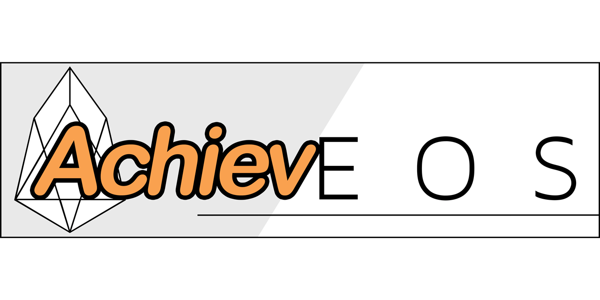

# Achieveos
_Achieve(ments) + EOS = Achieveos_

An open platform for Achievements/Badges/Trophies that will be preserved forever on the EOS blockchain.

## Motivation
### Achievements should have permanence
Current achievement systems are completely siloed in their own ecosystems (e.g. XBox Live gamertag, high school sports records, certifications for tech or skills training, etc) and therefore suffer from varying levels of impermanence and fragility. I can work hard to unlock a new badge in my running app ("50-Mile Club!"), but if that service shuts down, all of my badges go with it. The town secretary might be keeping track of each annual Hot Dog Eating Contest winner, but the next administration could easily lose those records as personnel change.

### Enter the blockchain
Blockchains are as close to immutable, permanent digital storage as we're ever going to get. Writing achievements to the blockchain will preserve them regardless of what happens to the organization or company that originally granted the achievement/trophy/badge.

## Achieveos overview
Achieveos is an EOS smart contract that provides a simple, open platform for any permanent achievement system to be built upon. It is structured as a series of simple tables that have database-like relationships.

But because smart contracts are cumbersome to directly interact with, it's expected that richer web apps will be built on top of the Achieveos functionality. Think of Achieveos as the backend database.

The first demonstration web app, eternalbadge.com (coming soon), will be an example of how the Achieveos smart contract can be used. The smart contract details will be totally hidden away from the users; they won't need to know anything about blockchains to be able to use the site. But crucially, should eternalbadge.com ever shut down, all of the achievements managed through the site will live on forever on the EOS blockchain.

It's the best of both worlds: A user-friendly UI but with permanently accessible, non-siloed data.

In fact, a future site could leverage the exact same data and provide a new UI. Users could pick up right where they left off (well, sort of) and carry on in this "new" world.

### Structure
You start by creating your **Organization** which will define its own achievements and grant them to its members or users. It could be a new gaming app where players can unlock trophies for completing challenges. Or a local sports team that will track its season records. Or a school's National Honor Society that will log its new inductees and other honors.

Next you define whatever achievement **Categories** make sense for your Organization. The football team might want to separate their achievements for the season by "Offense", "Defense", and "Special Teams" records.

And finally you add **Achievements** within those Categories. "Longest Touchdown" would be an "Offense" record held by an individual wide receiver. "Most Sacks" would be a "Defense" season record. "Longest Field Goal" for "Special Teams".

Or for a gaming context maybe there's a "Challenge Badges" Category for achievements like "Killed 100 Beasts in 1 Round". The same game might also have a "League Trophies" Category for "Won an 8-Player Tournament".

### Blockchain storage is expensive
The structure above writes the bare minimum data to the blockchain to minimize expenses while still ensuring that the data is human-readable.

Projects built on top of Achieveos are free to store more data via the optional `json_data` field in each struct. For example, you could include the url for an icon asset for a given Category and perhaps a longer description:

```
json_data = {
  "icon": "https://somewhere/dir/someimage.png",
  "details": "This honor is awarded to the individual who demonstrates..."
}
```

The additional RAM costs of that storage on the EOS blockchain is up to each project or user to manage.

However, it likely makes more sense to take a hybrid approach: Store the bare minimum for posterity in Achieveos but have additional, richer data in a standard database.


## Running Tests
Requirements:
* nodeos
* cleos
* python3.6+
* virtualenv

See the [EOS getting started guide](https://developers.eos.io/eosio-home/docs/setting-up-your-environment) for information on installing the EOS local dev tools.

Create a new python3 virtualenv.

Install the python dependencies:
```
pip install -r requirements.txt
```

The tests are written using [EOSFactory](https://eosfactory.io/) which makes it easy to write thorough and complex unit tests in Python. EOSFactory will launch a local test node, generate user accounts, compile the smart contract, deploy it, and then execute your unit tests.

The entire process is kicked off by a single command:
```
# cd into the 'test' dir, then run:
python test_achieveos.py

# Or if you don't need to recompile:
python test_achieveos.py -s
```
